<h1 align="center">Hey there 👋, I'm BitlyTwiser (Josh)!</h1>

 

  

 

    <b>Enjoyer of things computational</b>
     
     
    
    
    
    
     
    
    

 

 

WHOAMI - What I do
-----------------
- Software engineer 🖥️  
- VIM user 📝  
- Professional tinkerer 🔧  
- Avid book reader 📖  
- Amateur radio human 📻  
- I enjoy clinging to rocks 🧗‍♂️  
- Motorcycles 🏍️  
- Jiu-Jitsu (aggressive hugging) 🥋  
- Caressing keyboards to make cool stuff 💻  
- Doggos 🐕  
- Coffee ☕  

I like doing stuff and making things ☮️

 

My (public) Work 📦
-----------
- ####  :&nbsp; Small, light ORM for simplicity
- ####  :&nbsp; An application runner using Tmux to spawn windows/programs based on a YAML config file.
- ####  :&nbsp; A dotenv loader for Zig
- ####  :&nbsp; Snek - A simple CLI builder for Zig applications
- ####  :&nbsp; Zinger - An HTTP library for network requests in Zig
- ####  :&nbsp; Decentralized file system using the InterPlanetary File System (IPFS) project, gRPC, and google protocol buffers.
  - ####  :&nbsp; An interface for Pufs ^^
- ####  :&nbsp; A Dark Web crawler to crawl Tor network nodes.
- ####  :&nbsp; A content site generate converting markdown -> HTML for a simple blogging platform (written in Zig). 
- ####  :&nbsp; Encryption program for hiding things
- ####  :&nbsp; Wrapper for the slog package in Go
- ####  :&nbsp; Split data into smaller chunks (Used primarily to split gRPC communications)
- ####  :&nbsp; Some Neovim configs (probably broken x.X )

 

Enjoyed Languages
------------------
 

 

Most used public languages (as per our overlord Github)
--------------------------

Some Stats (WakaTime)
--------------------
  

